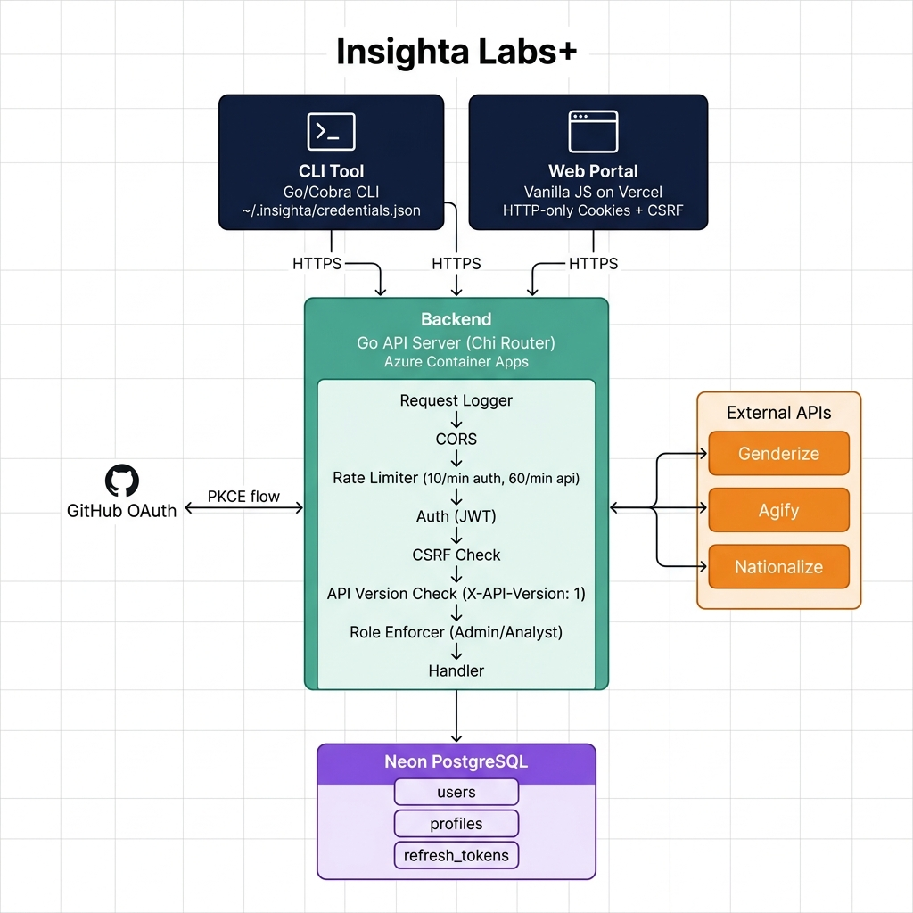

# Insighta Labs+ — Profile Intelligence Platform

Insighta Labs+ is a secure, multi-interface platform for discovering and analyzing intelligence profiles. This backend features GitHub OAuth with PKCE, JWT-based authentication, role-based access control, and complete API versioning.

## 🏛 System Architecture

The platform consists of three core components:
1. **Backend (This Repo)**: A Go API server using Chi Router and SQLx, connected to a Neon PostgreSQL database.
2. **CLI Tool (`insighta-cli`)**: A global Go/Cobra CLI for terminal access.
3. **Web Portal (`insighta-web`)**: A vanilla JS/Vite single-page application for visual access.

The backend acts as the single source of truth, enforcing security, rate limiting (10 req/min for auth, 60 req/min for API), and communicating with external enrichment APIs (Genderize, Agify, Nationalize).



## 🔐 Authentication Flow

We implemented a robust OAuth 2.0 flow using GitHub, fully supporting PKCE for the CLI:

### Web Portal Flow
1. User clicks "Continue with GitHub".
2. Redirected to `/auth/github?client=web`.
3. Backend redirects to GitHub OAuth.
4. On callback, backend issues an Access Token (3min) and Refresh Token (5min).
5. Tokens are set as **HTTP-only, Secure cookies** along with a readable CSRF token.

### CLI Flow (PKCE)
1. User runs `insighta login`.
2. CLI generates a local `code_verifier` and derived `code_challenge`.
3. CLI starts a temporary local server and opens the browser to `/auth/github?client=cli&code_challenge=...`.
4. On callback, backend exchanges the code securely and redirects to the CLI's local server.
5. CLI captures the tokens and stores them in `~/.insighta/credentials.json`.

## 🎟 Token Handling Approach

- **Access Tokens**: Short-lived (3 minutes) JWTs containing the user ID, username, and role. Verified statelessly via HMAC-SHA256 signature.
- **Refresh Tokens**: Opaque 32-byte strings (5 minutes). Stored as SHA-256 hashes in the database.
- **Rotation**: Every time a refresh token is used, it is immediately invalidated and a new pair is issued, preventing replay attacks.
- **Storage**: CLI stores them in a secure JSON file; Web portal uses `HttpOnly` cookies to prevent XSS exfiltration.

## 🛡 Role Enforcement Logic

Access control is handled via the `RequireRole` middleware, intercepting requests after the token is verified.

- **Admin**: Full read/write access. Can create (`POST /api/profiles`) and delete (`DELETE /api/profiles`) records.
- **Analyst**: Read-only access. Can list, search, view, and export profiles.

If an Analyst attempts a write action, the middleware immediately rejects the request with a `403 Forbidden`.

## 🧠 Natural Language Parsing Approach

The `GET /api/profiles/search?q=...` endpoint uses heuristic-based natural language parsing to interpret conversational queries:
- **Gender**: Checks for keywords (`male`, `men`, `female`, `women`).
- **Age Groups**: Maps conversational terms to groups (`child`, `kid`, `teen`, `adolescent`, `adult`, `senior`, `elderly`).
- **Age Ranges**: Regular expressions extract numerical intents (e.g., `above 25` → `min_age=25`). Special keywords map ranges (`young` → `16-24`).
- **Country**: Scans the query against a full dictionary of country names using word-boundary regexes to prevent false positives (e.g., matching "US" but ignoring it inside "music").

The interpreted parameters are then securely passed to the underlying dynamic SQL filter builder.

## 💻 CLI Usage

```bash
# Authentication
insighta login
insighta whoami
insighta logout

# Profile Management
insighta profiles list --gender female --country NG --page 1 --limit 10
insighta profiles search "young males from nigeria"
insighta profiles get <uuid>
insighta profiles create --name "Harriet Tubman"
insighta profiles export --format csv
```